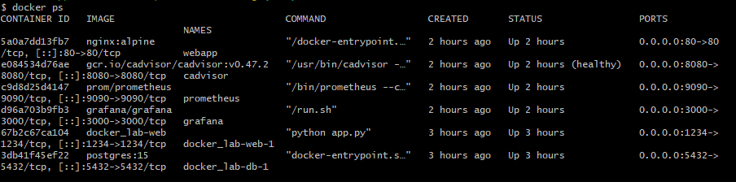
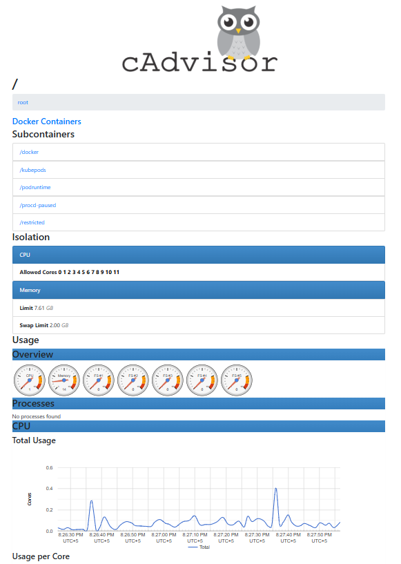
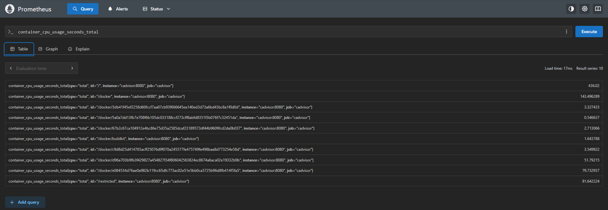
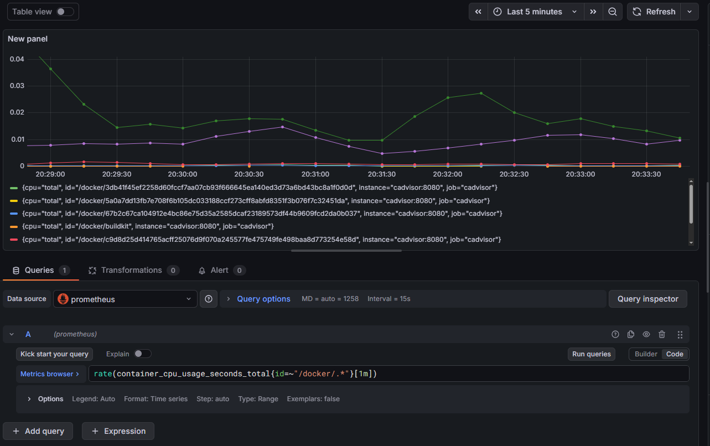
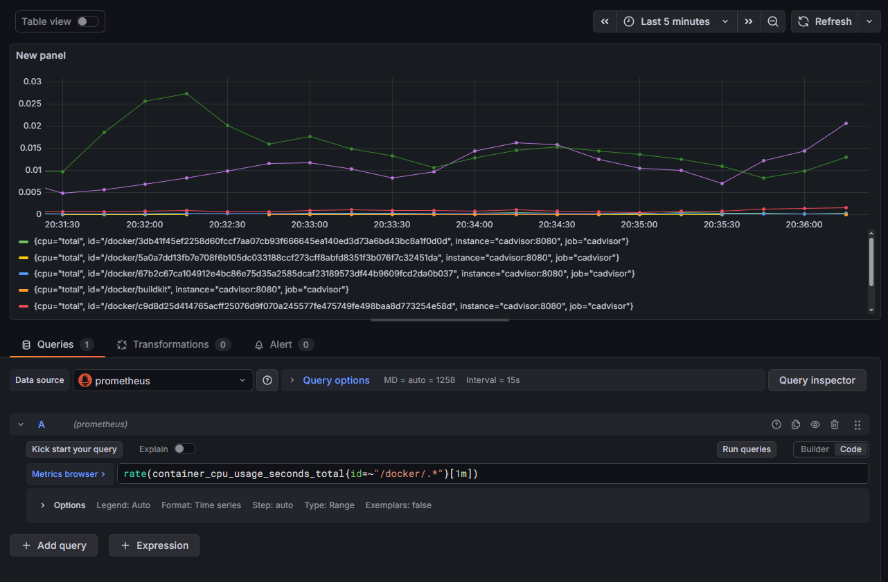

 # dop_docker-monitoring

## Мониторинг Docker-контейнеров с помощью Grafana и Prometheus

---

## 📌 Описание проекта

В данном проекте развернут стек мониторинга Docker-контейнеров, позволяющий
отслеживать состояние и производительность контейнеров в реальном времени.

### Используемые компоненты:
- **cAdvisor** — сбор метрик контейнеров (CPU, память, сеть, диск)
- **Prometheus** — хранение и обработка метрик
- **Grafana** — визуализация метрик
- **Nginx** — тестовое веб-приложение для генерации нагрузки

---

## 🏗 Архитектура

Docker containers  
↓  
cAdvisor  
↓  
Prometheus  
↓  
Grafana  

---

## 🚀 Запуск проекта

Для запуска всех сервисов выполните команду:

```bash
docker compose up -d
```

---

### 🌐 Веб-интерфейсы
- cAdvisor: http://localhost:8080
- Prometheus: http://localhost:9090
- Grafana: http://localhost:3000
- Web-приложение (nginx): http://localhost

---

### 📷 Скриншоты выполнения задания
1️⃣ Запущенные контейнеры Docker


2️⃣ Интерфейс cAdvisor


3️⃣ Prometheus — Targets (cAdvisor UP)


4️⃣ Prometheus — метрики CPU


5️⃣ Grafana — без нагрузки


6️⃣ Grafana — под нагрузкой


---

Команда генерации нагрузки (PowerShell):
```bash
1..2000 | ForEach-Object { Invoke-WebRequest http://localhost -UseBasicParsing | Out-Null }
```

---

### 📊 Анализ результатов
-  При отсутствии нагрузки потребление CPU минимально
- Во время генерации HTTP-запросов наблюдается рост нагрузки
- После завершения нагрузки показатели CPU возвращаются к норме
- Grafana отображает изменения метрик в реальном времени

---

### ✅ Вывод
В ходе выполнения работы был успешно развернут стек мониторинга Docker-контейнеров
на базе cAdvisor, Prometheus и Grafana. Реализация позволяет эффективно отслеживать
нагрузку и состояние контейнеров в реальном времени.

---

### 📁 Структура репозитория
dop_docker-monitoring/

├── README.md

├── docker-compose.yml

├── prometheus.yml

└── screenshots/

    ├── 01_docker_ps.png
    
    ├── 02_cadvisor.png
    
    ├── 03_prometheus_targets.png
    
    ├── 04_prometheus_metrics.png
    
    ├── 05_grafana_idle.png
    
    └── 06_grafana_load.png
